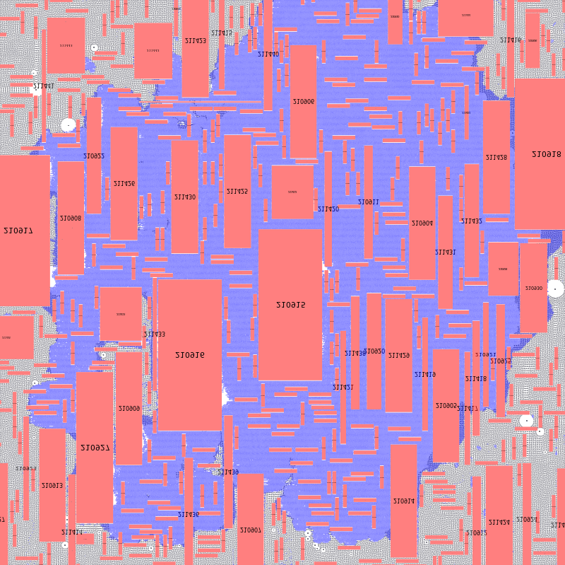
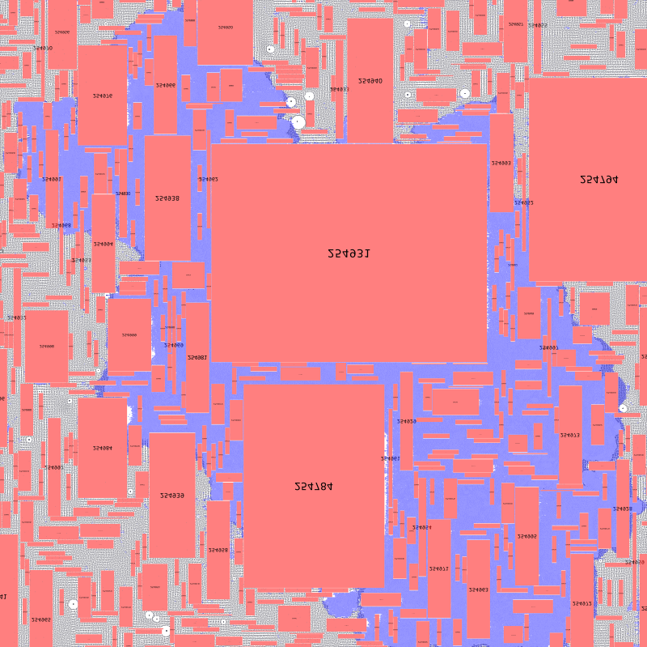
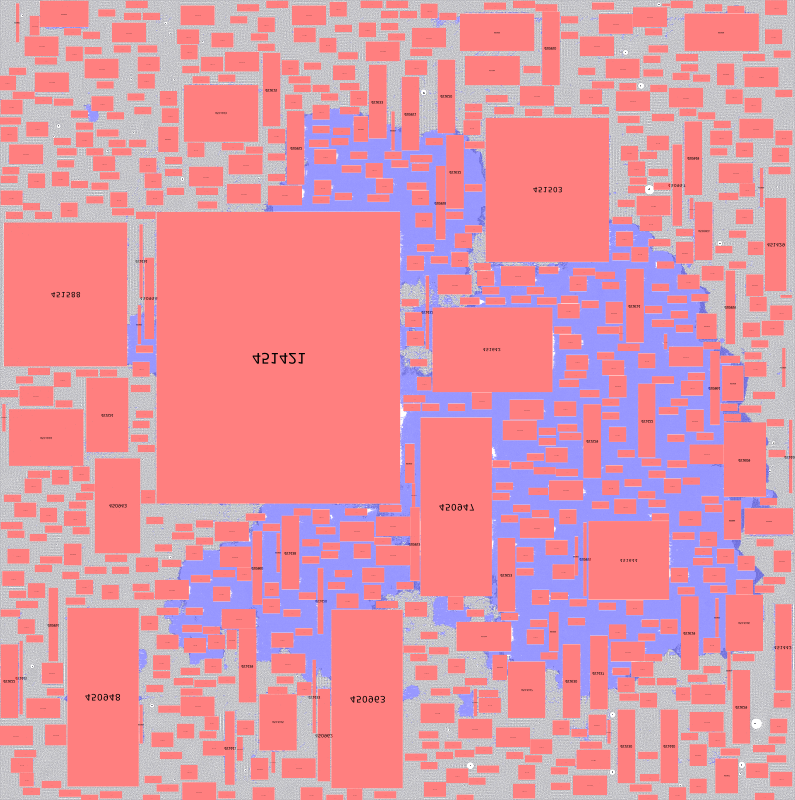
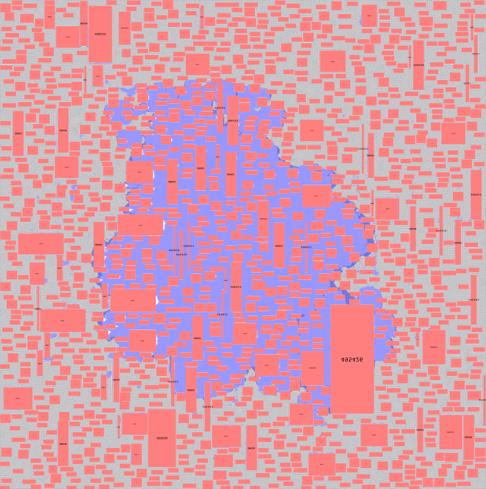
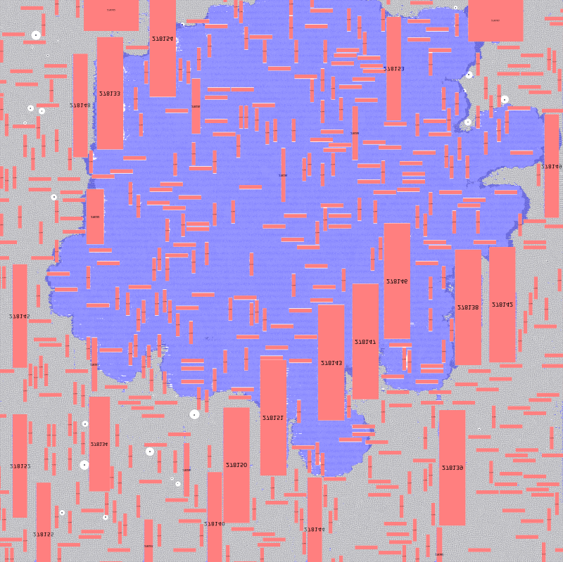
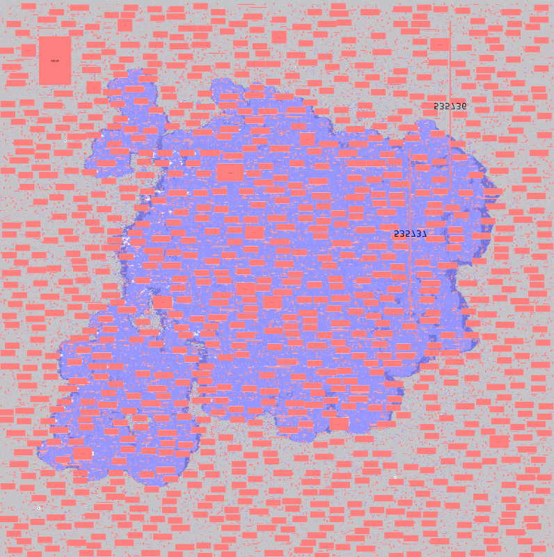
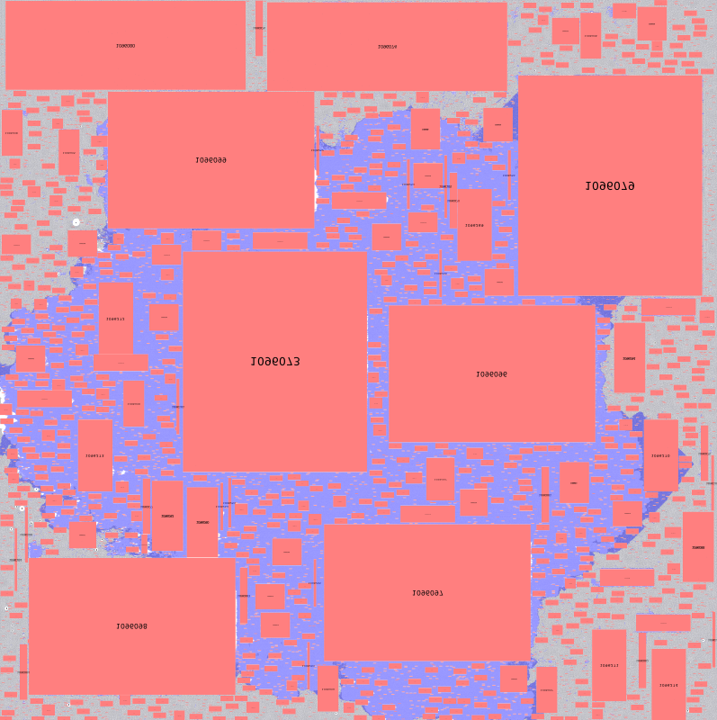
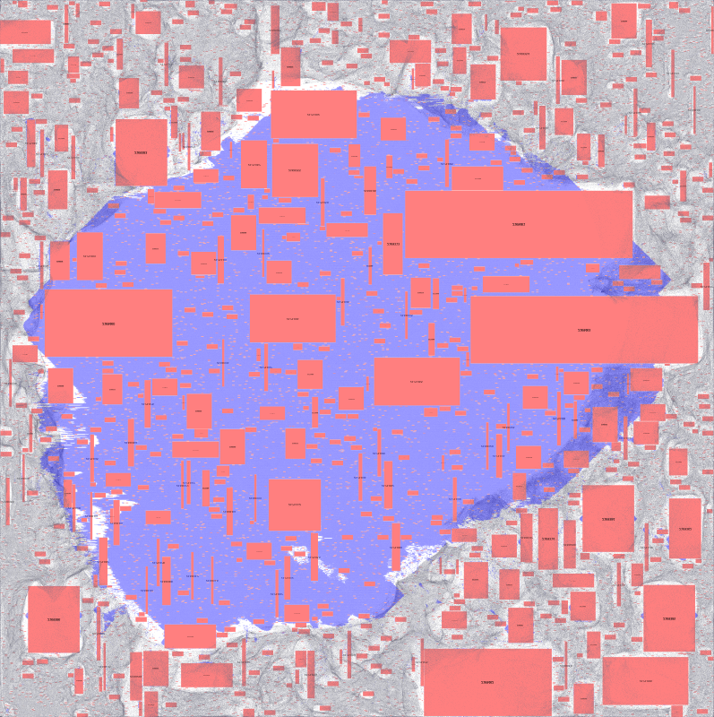

# DiffPlace - A Conditional Diffusion Framework for Simultaneous VLSI Placement Beyond Sequential Paradigms

Paper: [](https://arxiv.org/pdf/2510.15897)

## Experimental Results

The placement results on ISPD2005 benchmarks

| Adaptec1 | Adaptec2 | Adaptec3 | Adaptec4 |
|----------|----------|----------|----------|
|  |  |  |  |

| Bigblue1 | Bigblue2 | Bigblue3 | Bigblue4 |
|----------|----------|----------|----------|
|  |  |  |  |

## Project Structure

```
diffplace/
├── train.py                 # Training script
├── scripts/
│   └── deploy.py            # Inference
├── engine/
│   ├── diffplace.py         # Main model (DiffPlace)
│   ├── models.py            # Legacy models
│   ├── utils.py
│   ├── diffusion/           # Diffusion components
│   ├── training/            # Training utilities
│   ├── networks/            # Neural networks
│   ├── datasets/            # Data loading
│   └── conf/                # Configs
└── data/
    └── ispd2005/            # Benchmarks (see README inside)
```

## Quick Start

### Training
```bash
python train.py --config engine/conf/pretrain.yaml --data_dir path/to/synthetic/data
python train.py --config engine/conf/finetune.yaml --dataset_type ispd --data_dir data/ispd2005
```

### Inference
```bash
python scripts/deploy.py \
  --checkpoint path/to/checkpoint.pt \
  --benchmarks adaptec1 --visualize
```

## Requirements

```bash
pip install -r requirements.txt
```


